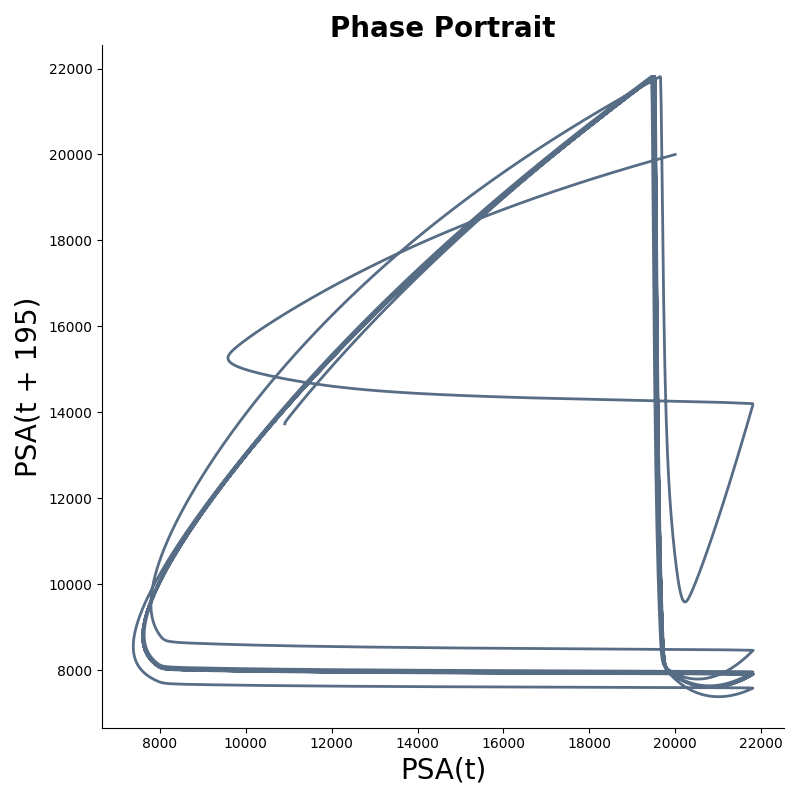
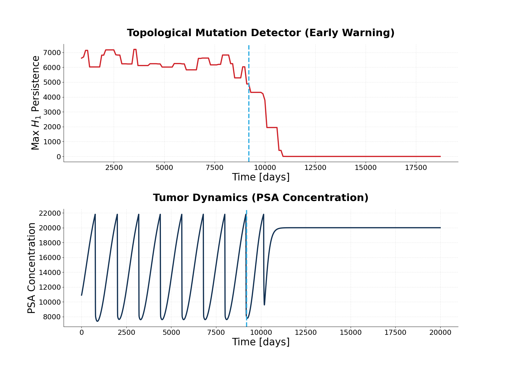

# Topological-early-warning-system-for-cancer-treatment-resistance
# Adaptive Therapy Topology

Topological early-warning system for resistance onset in adaptive prostate cancer therapy. Applies persistent homology to PSA time series generated from the Zhang et al. (2017) model.

---

## Background

Adaptive therapy (Zhang et al., 2017, *Nature Communications*) exploits competitive suppression between androgen-sensitive and androgen-independent cell populations. Rather than applying maximum tolerable doses, treatment is toggled on and off using PSA thresholds — keeping drug-sensitive cells alive to competitively suppress resistant ones, extending the period of disease control.

The central clinical challenge is detecting *when* this competitive balance breaks down — when resistant cells begin to dominate — before PSA has risen enough to be clinically obvious. This project applies tools from topological data analysis (TDA) to that detection problem.

---

## Idea

PSA is a scalar readout of an underlying multi-dimensional dynamical system. By Takens' embedding theorem, a time-delay embedding of a scalar observable generically reconstructs the topology of the original attractor. When the system undergoes a qualitative change — a shift in dominant cell population, the collapse of cyclic dynamics into a fixed point — the topology of the reconstructed attractor changes.

We track that change using H₁ persistent homology. During stable adaptive cycling, the PSA attractor contains a prominent loop (high H₁ persistence). As resistance takes over and cycling gives way to monotone growth, that loop dissolves — and the drop in max H₁ persistence precedes the overt PSA rise by hundreds of days.

---

## Model

Three competing cell populations following the Zhang 2017 parameterization:

- **T⁺** — androgen-sensitive cells, suppressed by treatment; carrying capacity scales with T_P under treatment
- **T_P** — androgen-sensitive proliferating cells; fixed carrying capacity
- **T⁻** — androgen-independent (resistant) cells; high fixed carrying capacity

Population dynamics follow a competitive Lotka-Volterra ODE. Drug is toggled off when PSA drops to 40% of the pre-treatment zenith and back on when PSA recovers to 80%. PSA is modeled as a first-order linear readout of total tumor burden.

---

## Pipeline

```
PSA time series
    → Takens embedding        (SingleTakensEmbedding, optimal τ and d by search)
        → Phase portrait      (2D delay projection)
        → Sliding windows     (SlidingWindow, size=1800, stride=100)
            → Vietoris-Rips   (VietorisRipsPersistence, H₁)
                → Max H₁ persistence vs. time
```

---

## Results

### Phase portrait

The 2D delay embedding of PSA traces a closed orbit during stable adaptive cycling. As resistance emerges, the orbit unwinds and the system escapes toward a fixed point — visible as the trajectory collapsing into a flat line in the lower right.



### Topological signal

Max H₁ persistence stays high (~6000–7000) throughout stable cycling, then begins collapsing around day 8500. The dashed line marks day ~9200, where PSA stops cycling and flatlines — the clinical signal of resistance. The topological warning precedes this by several hundred days.



This is the core result: the loop in the attractor dies before the PSA curve shows it.

---

## Structure

```
Model.py          ODE system, IAD switching logic, PSA interpolation
p_portrait.py     Takens embedding + phase portrait
p_homology.py     Sliding-window H₁ persistence over time
```

---

## Install

```bash
pip install numpy scipy giotto-tda matplotlib
```

---

## Run

```bash
python p_portrait.py     # phase portrait
python p_homology.py     # H₁ persistence signal
```

Parameters (initial cell counts, competition matrices, PSA thresholds) are defined at the top of each script, matching the Zhang 2017 parameterization.

---

## Reference

Zhang, J., Cunningham, J. J., Brown, J. S., & Gatenby, R. A. (2017). Integrating evolutionary dynamics into treatment of metastatic castrate-resistant prostate cancer. *Nature Communications*, 8, 1816. https://doi.org/10.1038/s41467-017-01968-5
